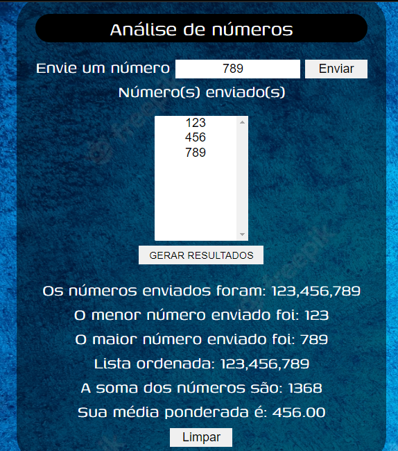

# Projeto: Analise de números array #
----
_Este projeto tem o objetivo de analisar os números enviados pelo usuário, armazenados em um array, retornando as informações como: lista ordenada dos números enviados, menor número encontrado, maior número encontrado e média ponderada._ 

----
Esta solução foi proposta através do [Curso em vídeo](https://www.cursoemvideo.com/curso/javascript/) na trilha de JavaScript.

## Tecnologias Desenvolvidas ##
- HTML
- CSS
- JavaScript

 

### Minhas redes ###
  